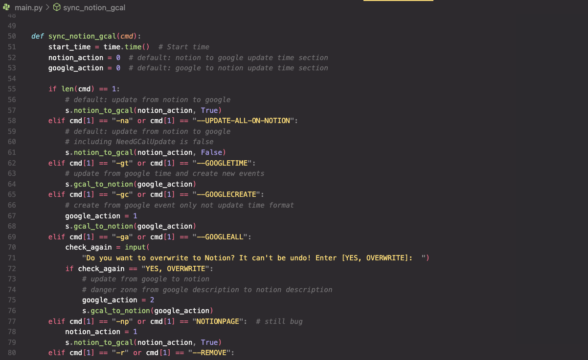
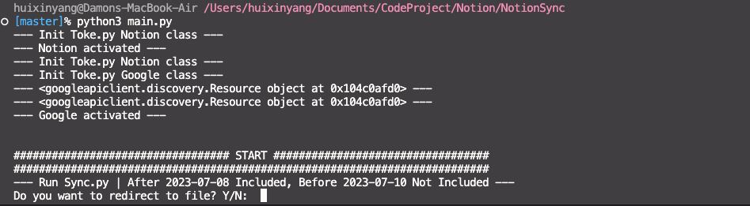
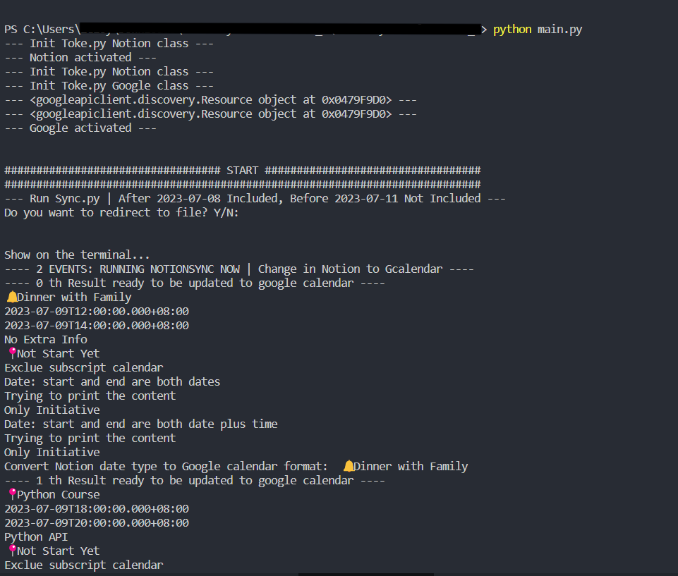

# Notion Synchronise with Google Calendar

> command-line interface to sync data between Notion and Google Calendar.

Do you find yourself juggling between Notion and Google Calendar to manage your events? Fret not! This awesome code is here to save your day. It magically extracts event details from your Notion Dashboard and seamlessly integrates them into your Google Calendar events. But wait, there's more! It even adds a handy URL to your GCal event, so you can effortlessly jump back to the specific Notion Page related to the event. How cool is that?

**Warning**: Proceed with caution! This repo wields the power to make changes to your Notion database and Google Calendar. So, if you're not confident about what you're doing, buckle up and brace yourself for some unexpected surprises.

## What you will need to get started

- Google account
- Notion account
- GitHub account (optional)
- python3 (or Docker)

## Current Capabilities:

- update events from google cal to notion
- update events from notion to google cal

### Functions:

- Ability to change timezones by changing `timecode` and `timezone` in `notion_setting`
- Ability to change the date range by changing `goback_days` and `goforward_days` in `notion_setting.json` (If you are a new IT guy here, please use 1 and 2 days respectively before you understand the code)
- Able to decide the default length of new GCal events by changing `event_length` in `notion_setting.json`
- Option to delete gCal events if checked off as `Done?` column in Notion
- Sync across _multiple calendars_ and choose which calendar you would like to sync by changing `gcal_dic` and `gcal_dic_key_to_value` in `notion_setting.json`
- Able to name the required Notion columns whatever you want and have the code work by changing `page_property` in `notion_setting.json`
- credential and OAuth consent screen with google calendar scope

# Sychronise Notion with Google Calendar

Go to the terminal, and change the folder to where these script are.:

```bash
cd src
```

Run the code to activate the connection between Notion and Google Calendar:

```bash
python3 main.py
```

At the first time, the page will be redirected to `Choose an account` page, and then click or log in your account. Just click `Continue`, and then `Continue`. Finally, close the authentication window. Go back to the terminal, you will see:

  

All commends and its comment in main.py are in `main.py`. You can change them as you want. I will explain most of them.

  

- Update from notion event needed to updated to google calendar (default)

  ```bash
  python3 main.py
  ```

  You will see the following message if you successfully connect to your google calendar. Type enter to continue and the code will start to run. If you do not want it run, type `Ctrl + C` to stop it.

  

  If you hit enter, you will see the following message. It means that the code is running. You can check your google calendar to see if it works.

  

- Update from all notion tasks to google calendar

  ```bash
  python3 main.py -na
  ```

- Update from google time which is in Notion, and create google new events which is not in Notion

  ```bash
  python3 main.py -gt
  ```

- Create google new events only

  ```bash
  python3 main.py -gc
  ```

- Replace all content of google event
  (I don't recommend using this function since my most contents are made by Notion tasks. However, it is still needed sometimes such as downloading events into notion at the first time)

  ```bash
  python3 main.py -ga
  ```

- Delete google events which is ticked in Notion

  ```bash
  python3 main.py -r
  ```

## Test

Change the folder to where these script are:

```bash
cd tests
```

### Test Notion Connection

Run specific test file:

```bash
python3 test_notion_setting.py
```

With unittest, you can use the -m flag and specify the test directory to run all test files in that directory. For example, if your test files are located in a folder named tests, you can run the following command:

```bash
python3 -m unittest discover -s .
```

### Test Google Calendar Connection

To be continued...

## Prettier

You can use prettier to format your code. It is a good tool to make your code more readable. In this `.prettierrc` configuration, we use the "overrides" key to specify formatting rules for different file types.

Note: Prettier is primarily designed for formatting JavaScript, TypeScript, CSS, and other web-related languages. It does not have built-in support for formatting Python code.

Install Prettier

```bash
npm install -g prettier
```

```bash
prettier -w .
```

## Black

Black is a Python code formatter. It is a good tool to make your code more readable.

```bash
black .
```
