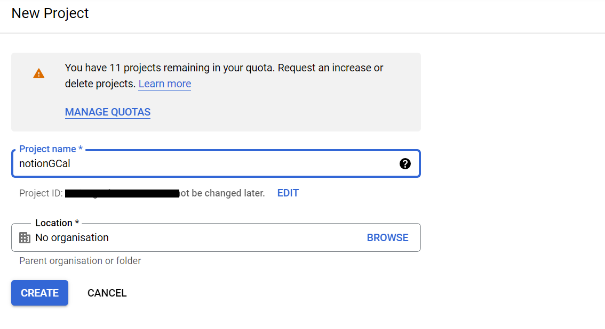
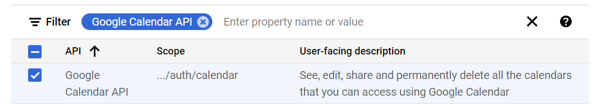

# Notion Synchronise with Google Calendar
The code will extract the event name, date/time, category, and extra information (text) from the Notion Dashboard and integrate that information into your GCal event. It will also add a URL source code to the GCal event so you can click on the URL and automatically be brought over to the specific Notion Page your event is at.

WARNING: This repo will access Notion's database and Google Calendar if you do not know what you are doing, it may cause unwanted changes.

## Current Capabilities:
- update events from google cal to notion
- update events from notion to google cal

### Functions:
- Ability to change timezones by changing `timecode` and `timezone` in `notion_setting`
- Ability to change the date range by changing `goback_days` and `goforward_days` in `notion_setting.json`
- Able to decide the default length of new GCal events by changing `event_length` in `notion_setting.json`
- Option to delete gCal events if checked off as `Done?` column in Notion
- Sync across *multiple calendars* and choose which calendar you would like to sync by changing `gcal_dic` and `gcal_dic_key_to_value` in  `notion_setting.json`
- Able to name the required Notion columns whatever you want and have the code work by changing `page_property` in `notion_setting.json`
- credential and OAuth consent screen with google calendar scope

Inspired by [akarri2001/Notion-and-Google-Calendar-2-Way-Sync](https://github.com/akarri2001/Notion-and-Google-Calendar-2-Way-Sync)

## How to install it
- Download [python](https://www.python.org/downloads/)

- Fork or Clone git repository

    1. In the top-right corner of the page, click Fork.

    

    2. Select an owner for the forked repository.

    3. Choose the main branch 

    4. Click `Create Fork`.

    5. Clone your forked repository

    

    6. Open the terminal, and type:

    ```bash
    git clone https://github.com/YOUR-USERNAME/YOUR-REPOSITORY-NAME
    ```

- Change directory to where you download, and then install packages

    ```bash
    cd YOUR-REPOSITORY-NAME
    pip3 install -r requirements.txt
    ```

- Duplicate the template as the initial database [NotionGCal](https://huixin.notion.site/aa639e48cfee4216976756f33cf57c8e?v=6db9353f3bc54029807c539ffc3dfdb4)

- Notion Connection Setting

    1. Open your Notion and click `Settings and members`, and then click here
    

    2. Create `New integration` and then `Submit`
    

    3. Open the template page, click `...`, then click `Add connection`. (Select what you name your connection)
    

- Complete the `notion_setting.json` in the `token_blank` folder, and then rename the folder `token_blank` with `token` (.gitignore will exclude files in this `token` folder to protect your sensitive information)

    - "notion_token": "Paste your Internal Integration Token which starts with `secret_...`",
    

    - "urlroot": "https://www.notion.so/{YOURNOTIONNAME}/{databaseID}?XXXXX",
    - "database_id": "look the same link, only paste databaseID",
    

    - the following items is up to you
        - "timecode": "+08:00",
        - "timezone": "Australia/Perth",
        - "goback_days": 1,
        - "goforward_days": 7,
        - "delete_option": 0,
        - "event_length": 60,
        - "start_time": 8,
        - "allday_option": 0,

    - Go to your google calendar page, and then click `Settings` on the top-right, next, scroll the left bar to find `Setting for my calendar`. Click it, calendar `Name` is on the top, and scroll down to find `Calendar ID`
        - "gcal_default_name": "YOUR CALENDAR NAME",
        - "gcal_default_id": "YOUR CALENDAR ID",

    - Enter your default calendar at least. If you want to add multiple calendars, separate them by `,` 
        - "gcal_dic": [{"YOUR CALENDAR NAME1": "YOUR CALENDAR ID1", "YOUR CALENDAR NAME2": "YOUR CALENDAR ID2"}],
        - "gcal_dic_key_to_value": [{"YOUR CALENDAR ID1": "YOUR CALENDAR NAME1", "YOUR CALENDAR ID2": "YOUR CALENDAR NAME2"}],

    - The following items are column names in notion based on my template. The `page_property` section is setting these column name.
        - "Task_Notion_Name": "Task Name", 
        - "Date_Notion_Name": "Date",
        - "Initiative_Notion_Name": "Initiative",
        - "ExtraInfo_Notion_Name": "Extra Info",
        - "On_GCal_Notion_Name": "On GCal?",
        - "NeedGCalUpdate_Notion_Name": "NeedGCalUpdate",
        - "GCalEventId_Notion_Name": "GCal Event Id",
        - "LastUpdatedTime_Notion_Name" : "Last Updated Time",
        - "Calendar_Notion_Name": "Calendar",
        - "Current_Calendar_Id_Notion_Name": "Current Calendar Id",
        - "Delete_Notion_Name": "Done?",
        - "Status_Notion_Name": "Status",
        - "Page_ID_Notion_Name": "PageID",
        - "CompleteIcon_Notion_Name": "CompleteIcon"}]
    You can change the column name without modifying the main code zone as long as you alter this section and notion columns consistently.

- Create a google token, and make sure your scope include google calendar
    1. Go to [google developers](https://console.developers.google.com/) 

    2. Create a New Project, and select it
    
    
    

    3. Clikc `+ ENABLE APIS AND SERVICES` to enable google calendar API, and then add your email
    
    

    4. You enabled google calendar API successfully if you see this
    

    5. Click `+ CREATE CREDENTIALS`
    
    
    6. Click `CONFIGURE CONSENT SCREEN`, and then select `External` and click `CREATE`
    
    7. Name whatever you want, and select your email as `User support email`. Next, type your email to `Developer contect information`, and then click `SAVE & CONTINUE`

    8. Click `ADD OR REMOVE SCOPES`, and then Select the scope as belows. Scroll down and click `UPDATE` 
    
    
    

    9. Scroll down, and click `Save and Continue`
    
    10. Click `+ ADD USERS` and click `Save and Continue`
    

    11. Create the OAuth client ID
    
    
    12. Name your application, and then click `CREATE`
    

    13. Download `.json` (Note: Dont show with others otherwise they may access your account)
    
    
    14. Rename `client_secret_XXXXXXXXXXXX.json` to `client_secret.json`, and then move it into `token` folder

Congraduations! All settings are done! Let's run the program.

# Sychronise

- Update from notion to google

```bash
python3 main.py
```

At the first time, the page will be redirected to `Choose an account` page, and then click or log in your account. Just click `Continue`, and then `Continue`. Finally, close the authentication window. Go back to the terminal, you will see:


Type this again

```bash
python3 main.py
```

- Update from google time which is in Notion, and create google new events which is not in Notion

```bash
python3 main.py -gt
```

- Create google new events only

```bash
python3 main.py -gc
```

- Replace all content of google event
(I don't recommend using this function since my most contents are made by Notion tasks. However, it is still needed sometimes such as downloading events into notion at the first time)

```bash
python3 main.py -ga
```

- Delete google events which is ticked in Notion

```bash
python3 main.py -r
```