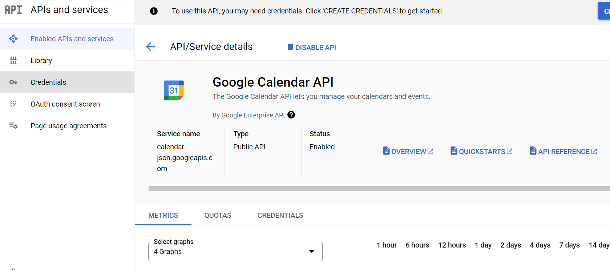
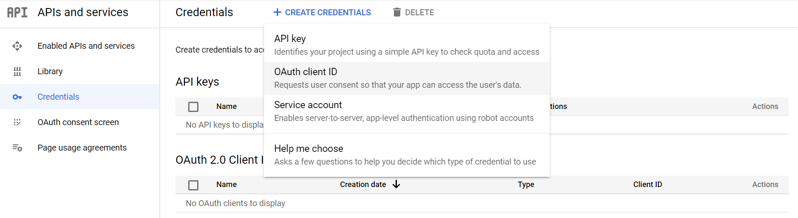

# Notion Synchronise with Google Calendar
The code will extract the event name, date/time, a category, and extra information (text) from the Notion Dashboard and integrate that information into your GCal event. Additionally, it will also add a URL source code the GCal event so you can click on the URL and automatically be brought over to the specific Notion Page that your event is at.

WARNING: This repo will access Notion's database and Google Calendar if you do not know what are you doing, it may cause unwanted changes.

## Current Capabilities:
- update events from google cal to notion
- update events from notion to google cal

### Functions:
- Sync across *multiple calendars* and choose which calendar you would like to sync by changing `gcal_dic` and `gcal_dic_key_to_value`
- Able to name the required Notion columns whatever you want and have the code work
- Able to add in end times and sync that across both platforms
- Able to decide if a date in Notion will make an event at a desired time or if it will make an All-day event
- Ability to change timezones by changing `timecode` and `timezone` in `notion_setting`
- Ability to change the date range by changing `goback_days` and `goforward_days` in `notion_setting`
- Option to delete gCal events if checked off as `Done?` column in Notion
- Able to decide default length of new GCal events 
    - credential and OAuth consent screen with google calendar scope

Inspired by [akarri2001/Notion-and-Google-Calendar-2-Way-Sync](https://github.com/akarri2001/Notion-and-Google-Calendar-2-Way-Sync)

## How to install it
- Download [python](https://www.python.org/downloads/)

- Fork or Clone

    1. In the top-right corner of the page, click Fork.

    

    2. Select an owner for the forked repository.

    3. Choose the main branch 

    4. Click `Create Fork`.

    5. Clone your forked repository

    

    6. Open terminal, and type:

```bash
git clone https://github.com/YOUR-USERNAME/YOUR-REPOSITORY-NAME
```

- Change directory to where you download, and then install packages

```bash
cd YOUR-REPOSITORY-NAME
pip3 install -r requirements.txt
```

- Duplicate the template as the initial database [NotionGCal](https://huixin.notion.site/aa639e48cfee4216976756f33cf57c8e?v=6db9353f3bc54029807c539ffc3dfdb4)

- Notion Connect Setting

    1. Open your Notion and click `Settings and members`, and then click here
    

    2. Create `New integration` and then `Submit`
    

    3. Open the template page, click `...`, then click `Add connection`. (Select what you name your connection)
    

- Complete the `notion_setting.json` in the `token_blank` folder, and then rename the folder `token_blank` with `token`

    - "notion_token": "Paste your Internal Integration Token which starts with `secret_...`",
    

    - "urlroot": "https://www.notion.so/{YOURNOTIONNAME}/{databaseID}?XXXXX",
    - "database_id": "look the same link, only paste databaseID",
    

    - the following items is up to you
        - "timecode": "+08:00",
        - "timezone": "Australia/Perth",
        - "goback_days": 1,
        - "goforward_days": 7,
        - "delete_option": 0,
        - "event_length": 60,
        - "start_time": 8,
        - "allday_option": 0,

    - Go to your google calendar page, and then click `Settings` on the top-right, next, scroll the left bar to find `Setting for my calendar`. Click it, calendar `Name` is on the top, and scroll down to find `Calendar ID`
        - "gcal_default_name": "YOUR CALENDAR NAME",
        - "gcal_default_id": "YOUR CALENDAR ID",
    - Enter your default calendar at least. If you want to add multiple calendars, separate them by `,` 
        - "gcal_dic": [{"YOUR CALENDAR NAME1": "YOUR CALENDAR ID1", "YOUR CALENDAR NAME2": "YOUR CALENDAR ID2"}],
        - "gcal_dic_key_to_value": [{"YOUR CALENDAR ID1": "YOUR CALENDAR NAME1", "YOUR CALENDAR ID2": "YOUR CALENDAR NAME2"}],

    - the following items is column name in notion based on my template.
        "page_property": [{
        "Task_Notion_Name": "Task Name", 
        "Date_Notion_Name": "Date",
        "Initiative_Notion_Name": "Initiative",
        "ExtraInfo_Notion_Name": "Extra Info",
        "On_GCal_Notion_Name": "On GCal?",
        "NeedGCalUpdate_Notion_Name": "NeedGCalUpdate",
        "GCalEventId_Notion_Name": "GCal Event Id",
        "LastUpdatedTime_Notion_Name" : "Last Updated Time",
        "Calendar_Notion_Name": "Calendar",
        "Current_Calendar_Id_Notion_Name": "Current Calendar Id",
        "Delete_Notion_Name": "Done?",
        "Status_Notion_Name": "Status",
        "Page_ID_Notion_Name": "PageID",
        "CompleteIcon_Notion_Name": "CompleteIcon"}]

- Create a google token, and make sure your scope include google calendar
    1. Go to [google developers](https://console.developers.google.com/) 

    2. Create a New Project, and select it
    
    
    

    3. Clikc `+ ENABLE APIS AND SERVICES` to enable google calendar API, and then add your email
    
    

    4. You enabled google calendar API successfully if you see this
    

    5. Click `+ CREATE CREDENTIALS`
    
    
    6. Click `CONFIGURE CONSENT SCREEN`, and then select `External` and click `CREATE`
    
    7. Name whatever you want, and select your email as `User support email`. Next, type your email to `Developer contect information`, and then click `SAVE & CONTINUE`

    8. Click `ADD OR REMOVE SCOPES`, and then Select the scope as belows. Scroll down and click `UPDATE` 
    
    
    

    9. Scroll down, and click `Save and Continue`
    
    10. Click `+ ADD USERS` and click `Save and Continue`
    

    11. Create the OAuth client ID
    
    
    12. Name your application, and then click `CREATE`
    

    13. Download `.json` (Note: Dont show with others otherwise they may access your account)
    

    14. Rename to `client_secret.json`, and then move it into `token` folder


- Update from notion to google

```bash
python3 main.py
```

- Update from google time which is in Notion, and create google new events which is not in Notion

```bash
python3 main.py -gt
```

- Create google new events only

```bash
python3 main.py -gc
```

- Replace all content of google event
(I don't recommend this function since most content is made by Notion tasks.)

```bash
python3 main.py -ga
```

- Delete google events which is ticked in Notion

```bash
python3 main.py -r
```


